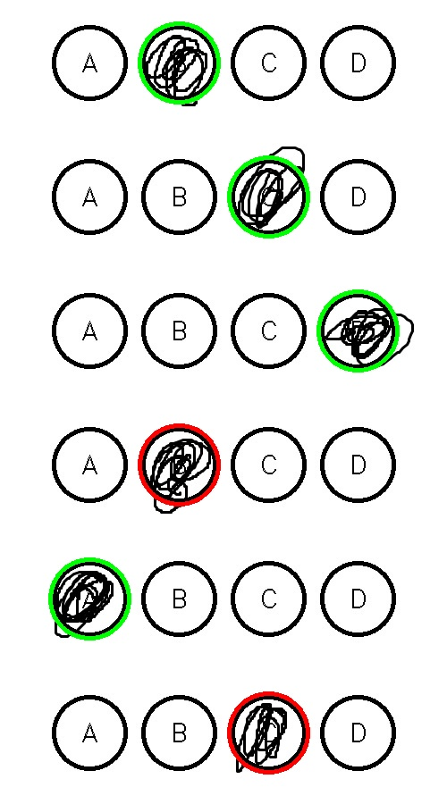

# Exam Autograder

## Overview

This OpenCV-based Python project can automatically grade exams from provided image files. The program will scan the image and identify the selected answer options, compare it with a user-provided answer key, and grade the exam. A graded exam image will be generated (with each selected answer circled in green or red depending on whether it was correct), and the scores are stored in a Firebase database.

## Features

- **Automated Grading**: Automatically grade exams from an image.
- **Custom Answer Keys**: A custom answer key can be provided via **.csv** file.
- **Visual Feedback**: A graded exam image is generated for each exam. Graded exam images have correct answers circled in green and wrong answers in red (color-coded to provide extra visual feedback).
- **Robust Detection**: Will detect chosen answers even if the answer-circle boundary is broken (drawn over).
- **Score Storage**: Scores are stored to a Firebase database, enabling easy data export and retrieval for grade-input purposes.

## Table of Contents

- [Getting Started](#getting-started)
- [Requirements](#requirements)
- [Setup](#setup)
- [Usage](#usage)
- [Examples](#Examples)
## Getting-Started

Follow the instructions below to set up and run the project on your own machine.

### Requirements

- Python 3.X
- OpenCV
- NumPy
- firebase_admin

### Setup

1. Clone the repository
```
git clone https://github.com/yjulianp/exam-autograder
cd exam-autograder
```
2. Add required files to the correct folders:
    - Place the answer key(s) in the **answer_key** folder. (**.csv format**)
    - Place the exam image(s) in the **images** folder.
    **Optional (for firebase)**:
    - Create an **auth** folder.
    - Place a config.txt file with a link to your firebase database, and your firebasekey.json file in the **auth** folder.

### Usage

1. Generate the exam-sheet template
```
cd src
python generateexam.py #will generate a template exam image
```
2. Run the project:
```
python findfilled.py
```

## Examples

#### Example 1
For the image **example1.jpg** with the answer key **example1.csv**:
##### Exam image

##### Marked Exam


#### Example 2 (messy answers)

For the image **example2** with the answer key **example2.csv**:
##### Exam image

##### Marked Exam

